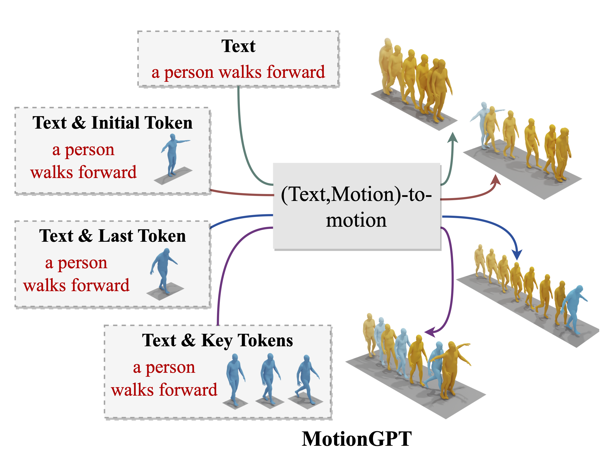

# MotionGPT: Finetuned LLMs are General-Purpose Motion Generators

[](https://arxiv.org/abs/2306.10900)

The official PyTorch implementation of the paper "[MotionGPT: Finetuned LLMs are General-Purpose Motion Generators](https://arxiv.org/abs/2306.10900)".

Please visit our [Project Page](https://qiqiapink.github.io/MotionGPT) for more details.



If you find MotionGPT useful for your work please cite:
```
@article{zhang2023motiongpt,
  title={MotionGPT: Finetuned LLMs are General-Purpose Motion Generators},
  author={Zhang, Yaqi and Huang, Di and Liu, Bin and Tang, Shixiang and Lu, Yan and Chen, Lu and Bai, Lei and Chu, Qi and Yu, Nenghai and Ouyang, Wanli},
  journal={arXiv preprint arXiv:2306.10900},
  year={2023}
}
```

## Table of Content
* [Installation](#installation)
* [Demo](#demo)
* [Train](#train)
* [Evaluation](#evaluation)
* [Visualization](#visualization)
* [Acknowledgement](#acknowledgement)

## Installation

## 1. Environment
```
conda create env -f environment.yml
conda activate motiongpt
```

## 2. Dependencies
For text to motion evaluation
```
bash prepare/download_evaluators.sh
bash prepare/download_glove.sh
```

For SMPL mesh rendering
```
bash prepare/download_smpl.sh
```

For using the LLaMa model weight, follow [pyllama](https://github.com/juncongmoo/pyllama) to download the original LLaMA model, and then follow [Lit-LLaMA](https://github.com/Lightning-AI/lit-llama) to convert the weights to the Lit-LLaMA format. After this process, please move the `lit-llama/` directory under the `checkpoints/` directory.

Once downloaded, you should have a folder like this:
```
MotionGPT
├── checkpoints
│   ├── kit
│   │   ├── Comp_v6_KLD005
│   │   ├── Decomp_SP001_SM001_H512
│   │   ├── length_est_bigru
│   │   ├── text_mot_match
│   │   └── VQVAEV3_CB1024_CMT_H1024_NRES3
│   ├── lit-llama
│   │   ├── 7B
│   │   │   └── lit-llama.pth
│   │   ├── 13B
│   │   └── tokenizer.model
│   └── t2m
│       ├── Comp_v6_KLD005
│       ├── M2T_EL4_DL4_NH8_PS
│       ├── T2M_Seq2Seq_NML1_Ear_SME0_N
│       ├── text_mot_match
│       └── VQVAEV3_CB1024_CMT_H1024_NRES3
├── body_models
│   └── smpl
│       ├── J_regressor_extra.npy
│       ├── kintree_table.pkl
│       ├── smplfaces.npy
│       └── SMPL_NEUTRAL.pkl
└── glove
    ├── our_vab_data.npy
    ├── our_vab_idx.pkl
    └── our_vab_words.pkl
```

## 3. Pretrained Models
For pretrained VQ-VAE models
```
bash prepare/download_vqvae.sh
```

For finetuned LLaMA model
```
bash prepare/download_lora.sh
```

Once downloaded, you should have a folder like this:
```
MotionGPT/checkpoints
├── pretrained_vqvae
│   ├── kit.pth
│   └── t2m.pth
└── pretrained_lora
    └── pretrained.pth
```

## 4. Dataset
Please follow [HumanML3D](https://github.com/EricGuo5513/HumanML3D) to download HumanML3D and KIT-ML datasets and put them under the directory `dataset` like:
```
MotionGPT/dataset
├── HumanML3D
└── KIT-ML
```

To prepare the dataset used for finetuning LLaMA, please follow the instructions below (take HumanML3D as an example)
```python
# Encode the motions to tokens by pretrianed VQ-VAE and save the token sequence results under `./dataset/HumanML3D/VQVAE/`
# For pretrained VQ-VAE, you can use the model provided or train the model by yourself following the training instruction.
python scripts/prepare_data.py --dataname t2m

# Generate the dataset on train split and validation split in the format of {instruction, input, output}
# Results saved as `./data/train.json` and `./data/val.json`
python scripts/generate_dataset.py --dataname t2m

# Generate corresponding instruction tuning dataset
# Results saved as `./data/train.pt` and `./data/val.pt`
python scripts/prepare_motion.py --dataname t2m
```

## Demo
Give task description (`--prompt`) and conditions (`--input`) to generate corresponding motion. The motion in `npy` format (`demo.npy`) and skeleton visualization result (`demo.gif`) will be saved under {output_dir}.

Please set `--render` if you want to render SMPL mesh.

```
# text-to-motion
python generate_motion.py --prompt "Generate a sequence of motion tokens matching the following human motion description." --input "a person walks forward." --lora_path ./checkpoints/pretrained_lora/pretrained.pth --out_dir {output_dir} --render

# (text, init pose)-to-motion
python generate_motion.py --prompt "Generate a sequence of motion tokens matching the following human motion description given the initial token." --input "a person walks forward.<Motion Token>315</Motion Token>" --lora_path ./checkpoints/pretrained_lora/pretrained.pth --out_dir {output_dir} --render

# (text, last pose)-to-motion
python generate_motion.py --prompt "Generate a sequence of motion tokens matching the following human motion description given the last token." --input "a person walks forward.<Motion Token>406</Motion Token>" --lora_path ./checkpoints/pretrained_lora/pretrained.pth --out_dir {output_dir} --render

# (text, key poses)-to-motion
python generate_motion.py --prompt "Generate a sequence of motion tokens matching the following human motion description given several key tokens." --input "a person walks forward.<Motion Token>315,91,406</Motion Token>" --lora_path ./checkpoints/pretrained_lora/pretrained.pth --out_dir {output_dir} --render
```

## Train
For VQ-VAE training
```
python train_vqvae.py --out_dir {output_dir} --dataname t2m
```

For finetuning LLaMA with LoRA
```
python finetune_motion.py --out_dir {output_dir} --dataname t2m
```

## Evaluation
For VQ-VAE
```
python eval_vqvae.py --out_dir {output_dir} --resume_pth {vqvae_model_path} --dataname t2m
```

For LLaMA
```
python eval.py --vqvae_pth {vqvae_model_path} --lora_path {fintuned_model_path} --out_dir {output_dir} --dataname t2m
```

## Visualization
The generated poses are all saved in `npy` format with the shape of `[seq_len, joint_num, 3]`

The output results are saved under the same directory with the corresponding filename in `gif` format

For visualization in skeleton format
```python
# To visualize all the poses saved in {saved_pose_dir}
python visualization/plot_3d_global.py --dir {saved_pose_dir}

# To visualize selected poses in {saved_pose_dir}
python visualization/plot_3d_global.py --dir {saved_pose_dir} --motion-list {fname1} {fname2} ...
```

For SMPL mesh rendering
```python
# To visualize all the poses saved in {saved_pose_dir}
python visualization/render.py --dir {saved_pose_dir}

# To visualize selected poses in {saved_pose_dir}
python visualization/render.py --dir {saved_pose_dir} --motion-list {fname1} {fname2} ...
```

## Acknowledgement
Thanks to [HumanML3D](https://github.com/EricGuo5513/HumanML3D), [T2M-GPT](https://github.com/Mael-zys/T2M-GPT) and [Lit-LLaMA](https://github.com/Lightning-AI/lit-llama), our code is partially borrowing from them.
